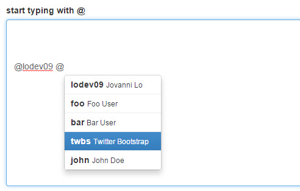

bootstrap-suggest
============================
A jQuery plugin for bootstrap that pops-up a dropdown in textarea or input textbox.



## V2
The version 2 of this plugin now supports bootstrap 4 and `contenteditable` that uses `jquery.caret` (optional).

## Install
Several quick start options are available:

- [download](https://github.com/lodev09/bootstrap-suggest/archive/v1.3.7.zip) latest release
- [npm](https://www.npmjs.com/package/bootstrap-suggest): `npm install --save bootstrap-suggest`
- [bower](https://bower.io): `bower install bootstrap-suggest`

** Make sure to link `bootstrap-suggest.js` and `bootstrap-suggest.css` to your project

## Usage

### Markup
```html
<div class="form-group">
   <label for="comment">start typing with @</label>
   <textarea class="form-control" rows="5" id="comment"></textarea>
</div>
```

### Data
```
var users = [
  {username: 'lodev09', fullname: 'Jovanni Lo'},
  {username: 'foo', fullname: 'Foo User'},
  {username: 'bar', fullname: 'Bar User'},
  {username: 'twbs', fullname: 'Twitter Bootstrap'},
  {username: 'john', fullname: 'John Doe'},
  {username: 'jane', fullname: 'Jane Doe'},
];
```

### Init
```javascript
$('#comment').suggest('@', {
  data: users,
  map: function(user) {
    return {
      value: user.username,
      text: '<strong>'+user.username+'</strong> <small>'+user.fullname+'</small>'
    }
  }
})
```

#### via Promise or ajax
Ajax is supported by having the data function return a <a href="http://api.jquery.com/Types/#jqXHR">jqXHR</a> object. The function takes a single parameter containing the mention text string.

```javascript
$('#comment').suggest('@', {
  data: function(q) {
    if (q) {
      return $.getJSON("users/data.json", { q: q });
    }
  },
  // ...
})
```

#### via "provide" function
A `provide` function is provided for you to call on after securing your data (don't return anything to the `data` option function to avoid conflict)
```javascript
$('#comment').suggest('@', {
  data: function(q, provide) {
    if (q) {
      $.getJSON("users/data.json", { q: q }, function(data) {
        // simply call provide and pass on your data!
        provide.call(data);
      });

      // we aren't returning any
    }
  },
  // ...
})
```

### Advanced
#### Add delay search while typing
```javascript
timeout = null;
$('#comment').suggest('@', {
  data: function(q, lookup) {
    var processData = function() {
      $.getJSON("users/lookup.json", { q: q }, function(data) {
        lookup.call(data);
      });
    };

    if (timeout) {
      clearTimeout(timeout);
      timeout = null;
    }

    timeout = setTimeout(processData, 500);
  },
  // ...
})

```

## API
http://lodev09.github.io/bootstrap-suggest/#api

## Credits
All bugs, feature requests, pull requests, feedback, etc., are welcome!

[Bootstrap Components](http://getbootstrap.com/components/)

## Copyright & License
Released under the [Apache License, Version 2.0](http://opensource.org/licenses/Apache-2.0).
See [LICENSE](LICENSE) file.

Copyright 2014-2017, Jovanni Lo / [@lodev09](http://twitter.com/lodev09) / [www.lodev09.com](http://www.lodev09.com "www.lodev09.com") / [lodev09@gmail.com](mailto:lodev09@gmail.com)
